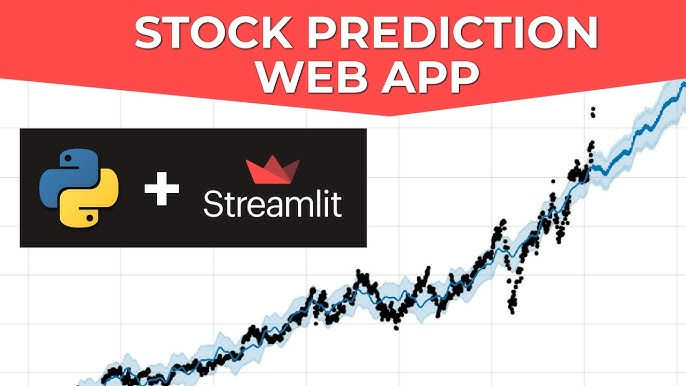

# MAANG Stock Prediction MLOps Pipeline using ZenML
Welcome to the MAANG-Stock-Prediction-MLOps repository. This project aims to provide an automated pipeline for forecasting stock prices of `MAANG` using machine learning and MLOps practices powered by ZenML.

## Table of Contents
- [Introduction](#introduction)

## Introduction
The world of stocks is ever-evolving, and forecasting stock prices can provide stakeholders with invaluable insights. This repository uses data from Kaggle and combines it with the power of machine learning and the robustness of ZenML pipelines and frontend inference using streamlit to predict `MAANG` stock prices.

## Workflow of ML based Software Development
- Three main artifacts in ML-based software: Data, Model, and Code.
- Three main phases: Data Engineering, ML Model Engineering, and Code Engineering.

### Data Engineering
- Data Engineering is the process of collecting, cleaning, and transforming data into a usable format for building ML models.
- Data Engineering is the most time-consuming part of the ML workflow.

#### Data Engineering Pipeline
1. **Data Ingestion**: Collecting data from various sources.
2. **Data Validation**: Validating the data to ensure that it is in the correct format.
3. **Data Transformation**: Transforming the data into a usable format for ML models.
4. **Data Splitting**: Splitting the data into training, validation, and testing sets.
5. **Data Versioning**: Versioning the data to keep track of changes.
6. **Data Analysis**: Analyzing the data to gain insights.

### ML Model Engineering
- ML Model Engineering is the process of building ML models.
- Objective of ML Model Engineering is to build a model that can make accurate predictions on unseen data.

#### ML Model Engineering Pipeline
1. **Feature Engineering**: Extracting features from the data.
2. **Model Training**: Training the model on the training data.
3. **Model Evaluation**: Evaluating the model on the validation data.
4. **Model Selection**: Selecting the best model based on the evaluation metrics.
5. **Model Versioning**: Versioning the model to keep track of changes.
6. **Model Packaging**: Packaging the model to make it usable in production.

### Code Engineering
- Code Engineering is the process of building a production-ready codebase for the ML model.
- Code Engineering is the most overlooked part of the ML workflow.

#### Code Engineering Pipeline
1. **Code Packaging**: Packaging the code to make it usable in production.
2. **Code Testing**: Testing the code to ensure that it works as expected.
3. **Code Deployment**: Deploying the code to a production environment.
4. **Code Monitoring**: Monitoring the code to ensure that it works as expected.

